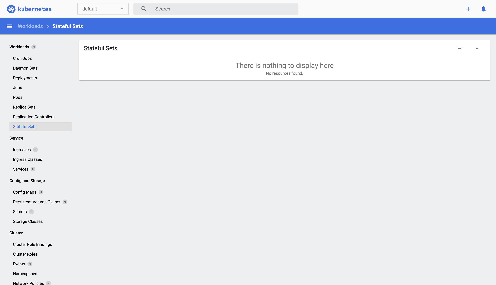

# <b> Kubernetes Basics </b>

According to the [Official Documentation](https://kubernetes.io/docs/concepts/overview/), Kubernetes (K8s) is a light-weight and extensible, Open Source tool that helps in the management of containerized applications and services. it's able to achieve this through declarative configuration and automation.

An intriguing fact that will help to remember what Kubernetes does can be found in its name. Kubernetes originates from Greek and it means pilot or helmsman.

## <b> Why Kubernetes? </b>

Owing to the advantages of containerization in the tech industry especially in area of packaging applications, you need a way to ensure no downtime in a production environment. This means that when you have deployed your applications to be used by consumers, you need to ensure that if a container (holding an application) goes down, another one gets started automatically.

In essence, K8s ensures a resilient running of your distributed system by taking care of scaling (up or down) or your resources, failover, and deployment of your applications.

## <b> What makes up Kubernetes? </b>

When you set up K8s, what you get is a highly available CLUSTER of computers that are connected to work as a unit. And in a cluster, you have what we call:

1. Control Plane and 
2. Nodes

The Control plane helps to manage the cluster while the Nodes are the workers (Virtual Machine or Physical computer) that run the applications. 

In managing the cluster, the control plane is in charge of maintaining the desired state of the resources as stated in the cofiguration files, scheduling applications, scaling, and rolling out new updates.

When you deploy applications on K8s, you are simply telling the control plane to start the application containers. The control plane scheduler also schedules the containers to run on the cluster's nodes.

The components that make up the control plane are:
1. <b>kube API</b>- server that exposes the Kubernetes API for communication between the Control plane and Nodes.
2. <b>etcd</b>- This serves as backup store for clusters data.
3. <b>scheduler</b>- this looks out for new pods that have been created and have no nodes assigned to them. It then moves to select the node for them to run on.
4. <b>kube-controller-manager</b>- This runs controller processes such as: noticing and responding when nodes go down, creating default ServiceAccounts for new namespaces, etc.
5. <b>cloud-controller-manager</b>- This allows you to connect your cluster to your cloud provider's API.

## <b> Minikube </b>
Minikube implements Kubernetes by creating a virtual machine on your local machine and deploys a simple cluster with just one node.

To use minikube to deploy :
1. Install minikube on your local machine (Linux, Windows or Mac).
2. Install kubectl
3. To create a custer on Minikube, use the command below to start the minikube with:
   ```
   minikube start
   ```
    Once the command has been executed, it means you now have a running local cluster.
4. When you have started the cluster and you do kubectl version, two things will be given as output.
   - Client version- the version of your kubectl.
   - Server version- the version of Kubernetes the control plane is running (on the minikube).

    Also, take note that when setting up your cluster and kubectl, You should install a kubectl version that is within one minor version difference of your cluster or you will get an error like this.

   ```
   WARNING: version difference between client (1.27) and server (1.23) exceeds the supported minor version skew of +/-1
   ```

5. This command helps to access the new cluster on minikube.
   ```
   kubectl get po -A
   ```
   

6. In a new terminal, type the command below to get the url to the minikube dashboard. 
   ```
   minikube dashboard --url
   ```
   
   
   This is what the dashboard looks like when you create a deployment.
   


