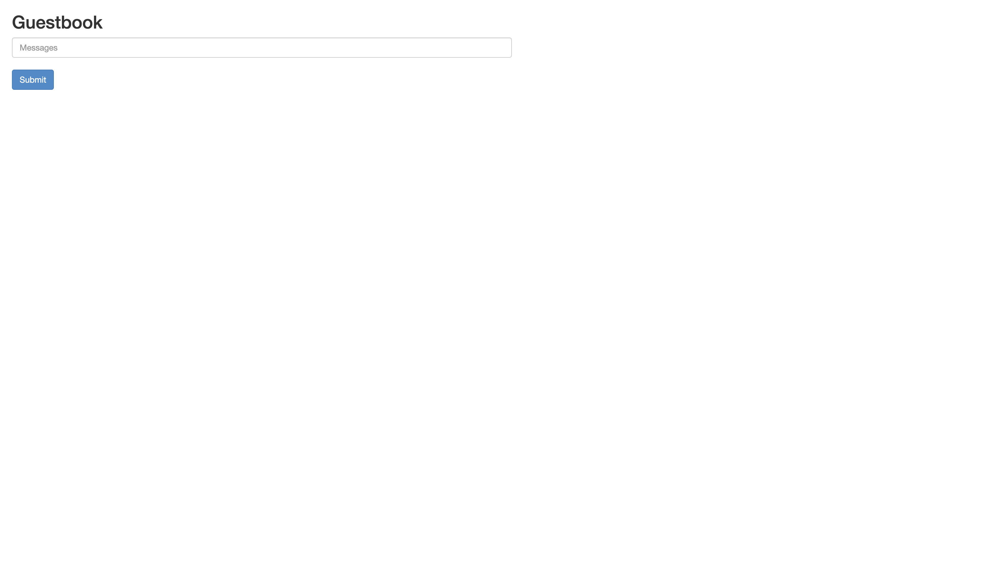

# <b> Deploying PHP Guestbook application with Redis </b>

1. After installing Minikube and Kubectl, start a cluster with one control plane and two nodes with tis command:
   
   ```
   minikube start --nodes 3 -p multinode-demo
   ```

2. Check the status of the cluster with:
   
   ```
   minikube status -p multinode-demo
   ```
   

3. Check the nodes with:
   
   ```
   kubectl get nodes
   ```
   

4. To get the url of the multi-nodes cluster dashboard use:
   
   ```
   minikube dashboard --url -p multinode-demo  
   ```
   

5. cd into the k8s-manifest directory and Use this command to create the Redis leader deployment: The guestbook application uses Redis to store its data.

   ```
   kubectl apply -f redis-leader-deployment.yaml 
   ```

   Check out the pod with:

   ```
   kubectl get pods
   ```

6. Other commands to apply the deployments andd services:
   ```
   kubectl apply -f redis-leader-service.yaml

   kubectl get service

   kubectl apply -f redis-follower-deployment.yaml

   kubectl get pods 

   kubectl apply -f redis-follower-service.yaml

   kubectl apply -f frontend-deployment.yaml

   kubectl get pods -l app=guestbook -l tier=frontend

   kubectl apply -f frontend-service.yaml

   kubectl get service

   ```

7. To View the Frontend Service via kubectl port-forward:
   
   ```
   kubectl port-forward svc/frontend 8080:80
   ```

    On your web browser, use the url,  `http://localhost:8080` to access the app.

    


8. You can allso scalle up or down with;
   
   ```
   kubectl scale deployment frontend --replicas=5
   kubectl scale deployment frontend --replicas=2
   ```

9. To clean up;
    ```
    kubectl delete deployment -l app=redis
    kubectl delete service -l app=redis
    kubectl delete deployment frontend
    kubectl delete service frontend
    ```
    


    
            
